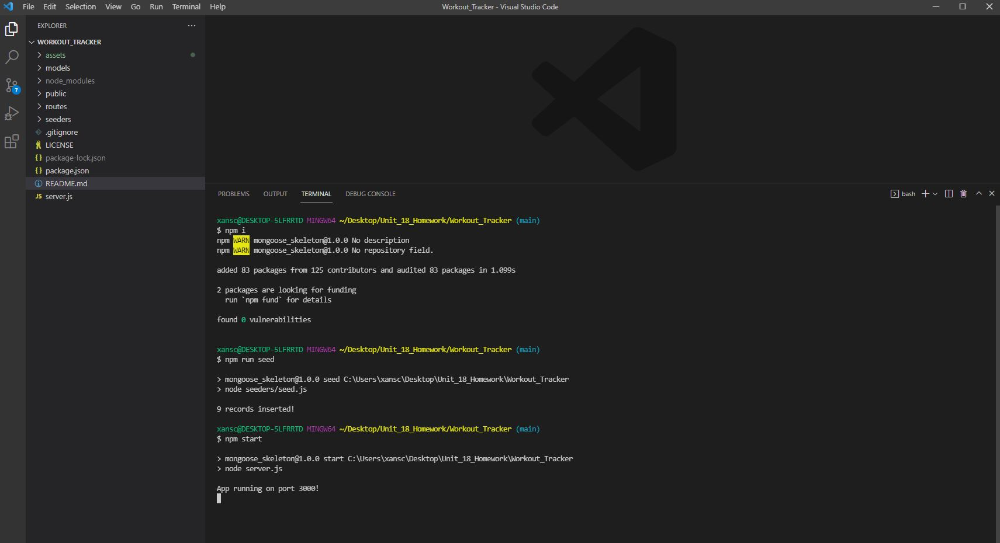
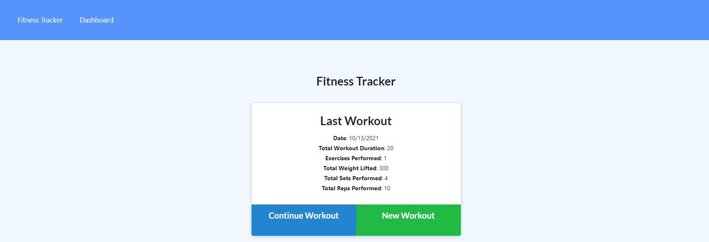
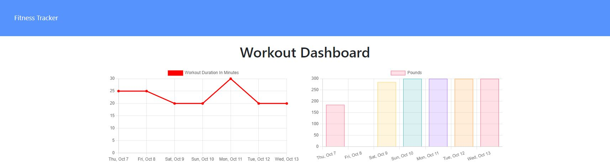
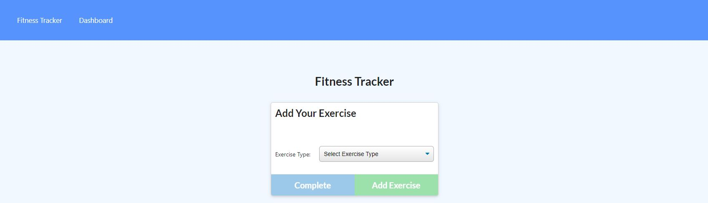
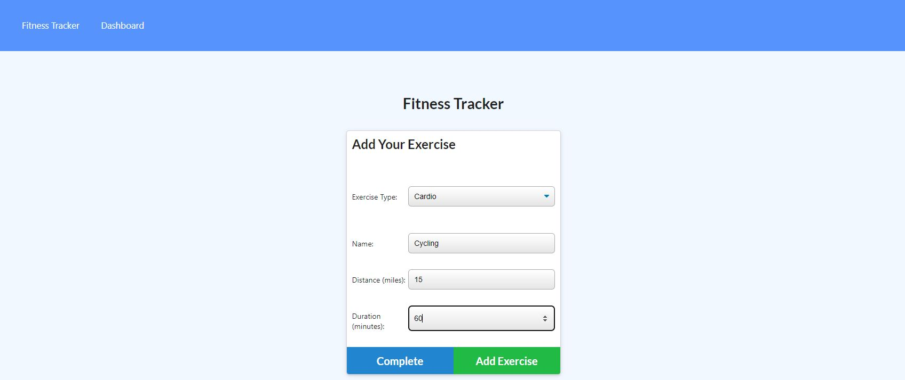
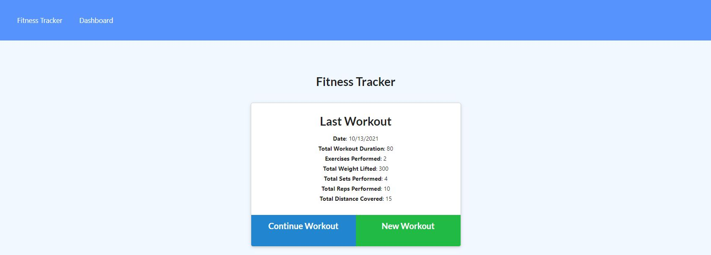
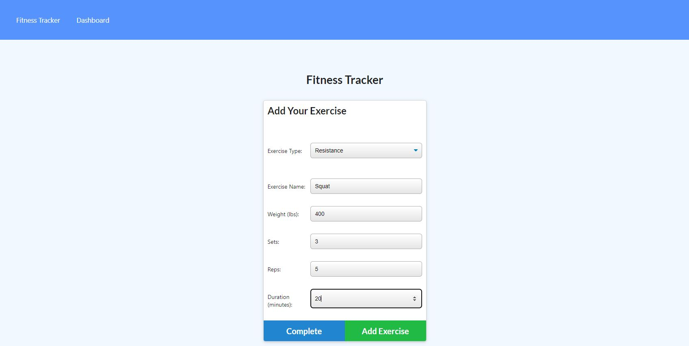
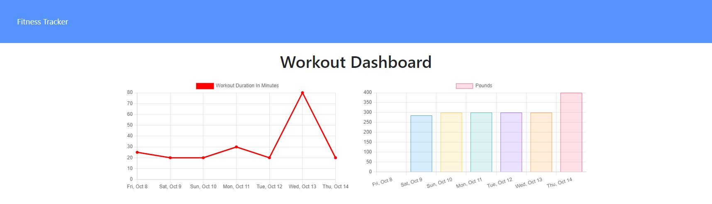

# Workout_Tracker

## Description

The goal of this project was to creat the back end for a workout tracker app. It involves a Mongo database, Mongoose schema, and routes utilizing Express. Upon startup the user is presented a summary of their last workout. The user is also given an option to continue their last workout, which will allow them to add exercises to it. Alternatively they can start a new workout and add exercises to that. There is a dashboard where they can view the total duration and weight lifted from each of their previous seven workouts.

## Table of Contents

1. [Description](#description)
2. [Installation](#installation)
3. [Usage](#usage)
4. [License](#license)

## Installation

First you will need to fork, then clone, the repository to your local, and make sure you're ready to use Node.js, Mongo, and Mongoose. After doing so, open the integrated terminal in the Workout_Tracker directory and in the command line enter "npm i" or "npm install" to install the necessary dependancies. This app comes with seed data. To use this, after installing the dependencies, simply enter "npm run seed." Now you can enter "npm start" to start the app. These commands and their terminal responses are shown below.  

## Usage

You can access the app by installing it and navigating to the localhost port or at the live app ((LINK TO BE ADDED)). Upon navigating to the app you will see a home page that shows a summary of the last workout.

  

Choosing to go to the dashboard will show stats of the total duration and weight lifted for the previous 7 workouts. On start up this will show the seed data.

  

Clicking the buttons for "Continue Workout" and "New Workout" will both bring up a page to enter exercise information and then choose to either "Complete" or "Add Exercise." Note that "Add Exercise" will add the entries and stay at the same page to allow for more exercise entries while "Complete" will add the entries and navigate back to the home page.

  

To show functionality, we'll do Continue Workout and add information for a Cardio exercise. Selecting an Exercise Type in the drop down will display the rest of the corresponding input fields. Switching types will switch the input fields to match.

  

After entering exercises and choosing "Complete," going back to the home page will show an updated Last Workout summary.

  

Now to show New Workout with adding information for a Resistance exercise.

  

After entering exercises and choosing "Complete," the homepage will show information for the just-added workout. Going to the dashboard you can see that information was added to the stats from the Cardio entry for the 2nd most recent workout and for the Resistance entry for the most recent workout.

  

You can check out the deployed app ((LINK TO BE ADDED)).

## License

The license under which this project is covered is the MIT License. Learn more about that license [here](https://choosealicense.com/licenses/mit/).
